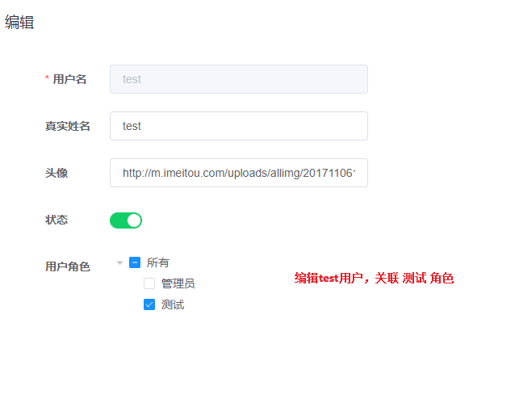
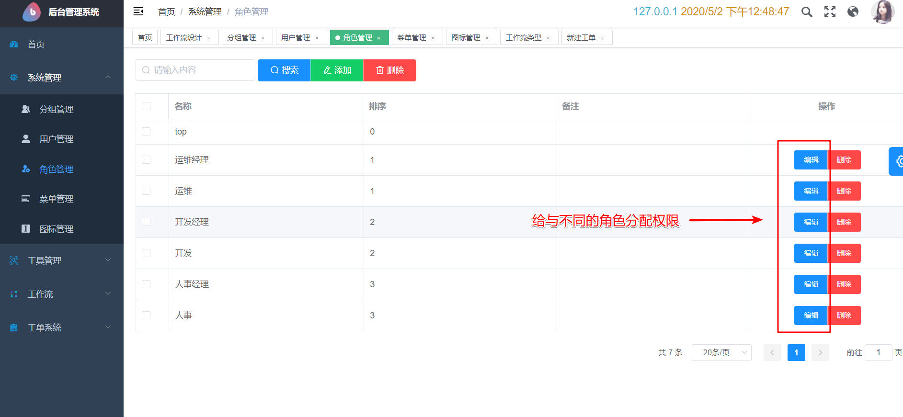
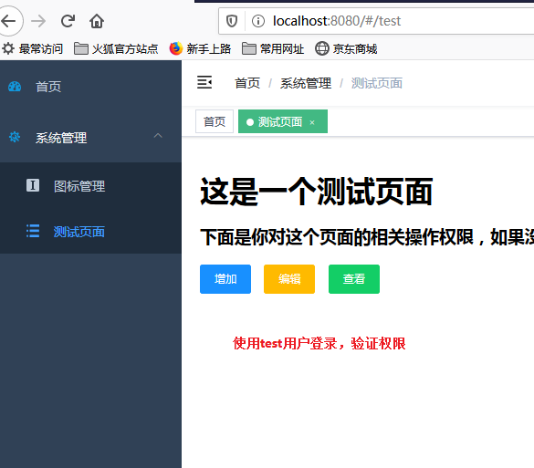

# django + vue 前后端分离的后台管理系统模板
包含 `用户`、`角色`、`菜单`、`权限` 管理， 这是一般后台系统一般都会有的功能， 后续其他功能都可以在这个基础上进行扩展。


## 开发环境
### 后端
```bash
cd backend
pip install -r dev_requirements.txt
python manage.py migrate
python manage.py init_sys
python manage.py init_wf
python manage.py init_ticket
python manage.py runserver
```
### 前端
```bash
cd frontend
npm install
npm run dev
```

## 相关权限菜单设置截图

### 新建 test 用户，并设置角色


### 编辑 test 角色，并关联菜单


### 登录 test 用户，查看权限



## 计划加个工作流系统
1. 模块权限未做验证，不能真正控制增删改查权限
2. 。。。
